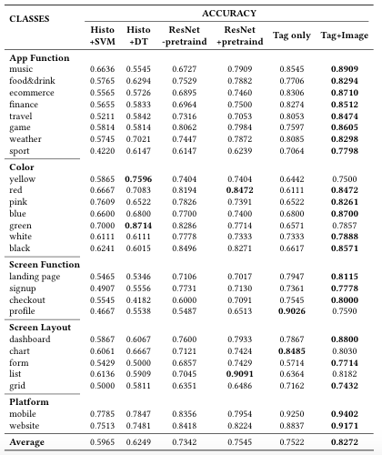

```diff
- 1. Create a new github
- 2. Check any personal authorship
- 3. Check dataset 
```
# From Lost to Found: Discover Missing UI Designs through Recovering Missing Semantics

Design sharing sites provide UI designers with a platform to share their works and also an opportunity to get inspiration from others' designs. To facilitate management and search of millions of UI design images, many design sharing sites adopt collaborative tagging systems by distributing the work of categorization to the community.

However, designers often do not know how to properly tag one design image with compact textual description, resulting in **unclear, incomplete, and inconsistent** tags for uploaded examples which impede retrieval, according to our empirical study and interview with four professional designers. 

Based on the deep neural network, we introduce **a novel approach for encoding both the visual and textual information** to recover the missing tags for existing UI examples so that they can be more easily found by text queries. We achieve 82.72\% accuracy in the tag prediction. Through a simulation test of 5 queries, our system on average returns hundreds of times more results than the default Dribbble search, leading to better relatedness, diversity and satisfaction.	

## Details
To demonstrate our task, we first show some examples to illustrate what is the fundamental limitations in existing design sharing platforms.

Figure 1 shows an example design from the design sharing website Dribbble of which tags illustrate the two problems with tagging-based search. 

<div style="color:#0000FF" align="center">
 
</div>

First, users may use different words to describe the same UI design based on their own background knowledge. The increase in the use of incoherent tags may hinder the content searching or navigation.
For example, when designers want to search for UI designs with "user interface", this design tagged with "ui" will be omitted.


Second, users may extract different topics from the same design according to their own understanding, hence missing some important tags associated with the GUI design images. 
When tagging the UI design, users tend to provide only a few keywords that describe the most obvious visual or semantic contents, while content in other aspects may be simply omitted.
For example, although this design is related to the "food" category, this label is missing from the tags.

<!--  -->

## EMPIRICAL STUDY OF DESIGN SHARING
In this work, we select Dribbble as our study subject. Since its foundation in 2009, Dribbble has become one of the **largest** networking platforms for designers to share their own designs and get inspirations from others'.
Only professional designers can be invited to upload their design works for sharing with the community, leading to the **high-quality** design within the site.

### DATASET
We build a [web crawler](Crawl/README.md) to collect designs and associated metadata from Dribbble from December 27, 2018 to March 19, 2019 with a collection of **226,000** graphical design.

We show some examples in our dataset, top is the designs and bottom is its metadata.
<div style="color:#0000FF" align="center">
 
</div>

Within the Dribbble site, the design creators can add at most 20 tags for their design work. 
```diff
+ add statistic for dataset and show UI importance. Among the top 30 most common tags, approximately 25% are UI related (e.g., “ui”, “ux”, “app”, “web”, “interface”, etc.), which indicates that user interface design is one of the most popular design areas on Dribbble.
```

The full dataset can be downloaded via [Google Drive](https://drive.google.com/open?id=1UpoAxyY66zlRlJ7z4ZfZUWu_FDpPRhRb)


### Overview of UI semantics

We adopt the [association rule mining and community detection](Semantics/README.md) for visualizing the landscape of UI tags. Figure shows the UI-related tag associative graph.
<div style="color:#0000FF" align="center">
 
</div>

### Vocabulary of UI semantics
We adopted a consensus-driven, iterative approach to combine the observed tag landscape with existing expert knowledge documented inbooks and websites such as Mobile Design Pattern Gallery and Google’s Material Design.

Table shows the categorization of some most frequent UI-related tags. For example, the APP FUNCTIONALITY category contains "MUSIC", "FOOD & DRINK", "GAME", and the subcategory "FOOD & DRINK" contains UI design tagged with "Food", "Restaurant", "Drink", etc.
<div style="color:#0000FF" align="center">
 
</div>

### Consistency of Vocabulary
We adopt a semi-automatic method (1) train a word embedding to extract semantically-related words like "minimal" and "minimalistic" (2) define a set of rules to discriminate the abbreviations (3) manually check the vocabulary

Table shows the 40 most frequent UI related tags with their abbreviations and synonyms and in brackets indicate the number of occurence.
<div style="color:#0000FF" align="center">
 
</div>

```diff
+ The full taxonomy can be downloaded via [Google Drive](https://drive.google.com/open?id=1UpoAxyY66zlRlJ7z4ZfZUWu_FDpPRhRb)
```

## AUGMENT TAGS FOR THE UI DESIGN

Figure shows the overview of our approach.
We first collect all existing UI design with specific tags identified in our empirical study, and then develop a binary tag prediction model (predicting the image is or isn't belonging to the tag) by combining a CNN model for capturing visual UI information and a fully-connected neural network for capturing textual information of existing tags.
Additionally, to understand how our ensemble model make its decisions through the visual information, we apply a visualization technique (Saliency Maps) for understanding which part of the figure leading to the final prediction.
<div style="color:#0000FF" align="center">
 
</div>

### Dataset preparing
Table 2 shows the statistics of our dataset for each tag. The dataset contains 50% positive and 50% negative samples.
```diff
+ Updating statistics
```
<div style="color:#0000FF" align="center">
 
</div>

<!-- These natural-language tags convey the semantics of the UI design such as internal structural information (e.g., "dashboard", "list", "chart") and belonging-software information (e.g., "ecommerce", "food", "travel").
Table 2 shows the statistics of our dataset. In total, we collect 7,594 applications, 13,145 screenshots and 19,233 components. Besides, we split our dataset into train/val/test set, with the approximate ratio of 0.8/0.1/0.1. -->

### Training and Visualizing process
Please follow the [Readme.md](RecoverTags/README.md) instruction in RecoverTags folder.

## EVALUATION
We set up several basic machine-learning baselines including the feature extraction (e.g., color histogram) with machine-learning classifiers (e.g., decision tree, SVM). **Results show that the improvement of our model is significant in all comparisons.**
<div style="color:#0000FF" align="center">
 
</div>

Figure shows some predicted additional tags for example UI designs by our model.
<div style="color:#0000FF" align="center">
 
</div>

Figure shows visualization of the salient features in our model leading to the final predictions.
<div style="color:#0000FF" align="center">
 
</div>

Common causes for tag augmentation failure. 
```diff
+ Figure with complete caption
```

## RETRIEVAL EVALUATION
We conduct a pilot user study to evaluate the usefulness of the predicted addition tags for boot-strapping the UI design retrieval.
```diff
+ Experiment and Result
```

<!-- Generalization&Usefulness contains all data we used in this part and the results from model(M), developers(A1,A2,A3) and Evaluator. -->

## License
[](https://www.gnu.org/licenses/old-licenses/gpl-2.0.en.html)